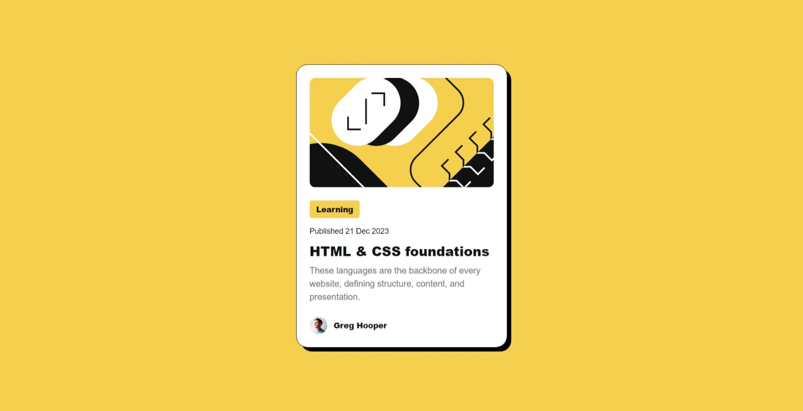

# Frontend Mentor - Blog preview card solution

This is a solution to the [Blog preview card challenge on Frontend Mentor](https://www.frontendmentor.io/challenges/blog-preview-card-ckPaj01IcS). Frontend Mentor challenges help you improve your coding skills by building realistic projects.

## Overview

### The challenge

Users should be able to:

- See hover and focus states for all interactive elements on the page

### Screenshot

### Links

- Solution URL: [https://www.frontendmentor.io/solutions/blog-preview-card-using-flexbox-and-gap-for-layout-qql_JFZZOb](https://www.frontendmentor.io/solutions/blog-preview-card-using-flexbox-and-gap-for-layout-qql_JFZZOb)
- Live Site URL: [https://artemgolovko.github.io/blog-preview-card](https://artemgolovko.github.io/blog-preview-card)

## Author

- Website - [Artem Golovko](https://artemgolovko.github.io)
- Frontend Mentor - [@ArtemGolovko](https://www.frontendmentor.io/profile/ArtemGolovko)
